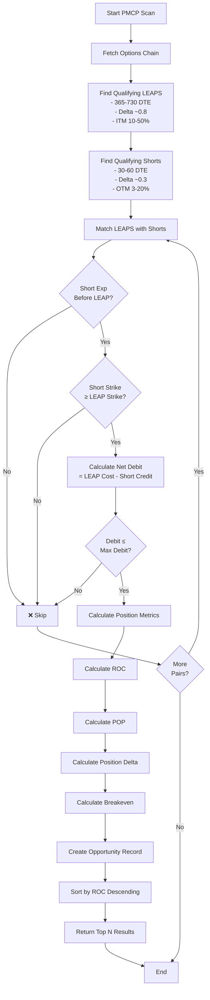
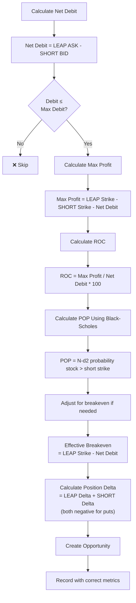

# PMCP Algorithm Analysis & Issues

## Overview
PMCP (Poor Man's Covered Put) is a bullish strategy that:
1. **Buys a long-term LEAP put** (ITM) - pay debit
2. **Sells short-term puts** (OTM) - collect credit
3. **Net debit** = LEAP cost - short credit
4. **Max profit** = short strike - leap strike - net debit
5. **ROC** = return on net debit deployed
6. **POP** = probability the position stays profitable at short expiration

---

## Algorithm Flow



---

## Issue #1: Incorrect ROC Calculation ⚠️

### Current Implementation (Lines 315-316 in PMCC)
```python
roc_pct = (short_premium / net_debit) * 100 if net_debit > 0 else 0
```

### Problem
- **Uses short premium as numerator** instead of max profit
- **ROC should be**: Return / Capital Deployed
- **For PMCP**: ROC = Max Profit / Net Debit

### Example
```
Stock: $100, LEAP Cost: $3.00, Short Credit: $1.00
Net Debit: $3.00 - $1.00 = $2.00 per share = $200 per contract

LEAP Strike: $95 (ITM)
Short Strike: $105 (OTM)
Max Profit: $105 - $95 - $2.00 = $8.00 per share = $800 per contract

Current (WRONG):
ROC = ($1.00 / $2.00) * 100 = 50%

Correct:
ROC = ($8.00 / $2.00) * 100 = 400%
```

### Fix
```python
# PMCC (Buy call, sell higher call)
max_profit = short_strike - leap_strike - net_debit
roc_pct = (max_profit / net_debit) * 100 if net_debit > 0 else 0

# PMCP (Buy put, sell lower put) - same formula
max_profit = leap_strike - short_strike - net_debit  
roc_pct = (max_profit / net_debit) * 100 if net_debit > 0 else 0
```

---

## Issue #2: Incorrect POP Calculation ⚠️

### Current Implementation (Line 609 in PMCP)
```python
pop_pct = (1 - abs(short_delta)) * 100
```

### Problem
- **Uses oversimplified delta approximation**
- **Doesn't account for debit paid**
- **Doesn't use Black-Scholes for accuracy**
- **Not suitable for premium-based strategies**

### Example
```
Short Put Delta: -0.30
Current POP = (1 - 0.30) * 100 = 70%

This assumes:
- Put expires worthless 70% of the time
- But ignores the strike levels
- Doesn't account for net debit breakeven
```

### Why It's Wrong
For PMCP, POP should be:
```
POP = Probability(Stock > Short Strike at expiration)
     + Probability(Stock at breakeven considering net debit)
```

### Fix - Use Black-Scholes
```python
# Calculate days to short expiration
days_to_exp = (short['expiration_date'] - datetime.now().date()).days
T = days_to_exp / 365.0

# Get implied volatility from short option
sigma = float(short.get('implied_volatility', 0.30))

# Calculate POP using Black-Scholes
# For PUT: POP = probability stock stays above short strike
pop = calculate_pop(
    S=underlying_price,  # Current stock price
    K=short_strike,      # Short strike
    T=T,
    r=risk_free_rate,
    sigma=sigma,
    option_type="put"
)
pop_pct = pop * 100
```

---

## Issue #3: Missing Breakeven Considerations ⚠️

### Current Implementation (Lines 342-345 in PMCC)
```python
# Calculate breakeven
if option_type == "call":
    breakeven = leaps_strike + (net_debit / 100)
else:
    breakeven = leaps_strike - (net_debit / 100)
```

### Problem
- **Breakeven calculation doesn't match POP calculation**
- **POP should be tested at breakeven, not at short strike**
- **For PMCP puts: True breakeven is LEAP strike - net debit**

### Correct Breakeven
```python
# For PMCP (Put spread):
# At expiration, you profit if stock > breakeven
breakeven = leap_strike - (net_debit / 100)
# Example: $95 LEAP strike - $2 net debit = $93 breakeven
```

---

## Issue #4: Data Type Mismatch in PMCP ⚠️

### Current Implementation (Line 608-609)
```python
leap_cost = float(leap.get('mark_price', 0))
short_credit = float(short.get('mark_price', 0))
```

### Problem
- **Using 'mark_price' for both legs**
- **For bought positions (LEAP): Use ASK price**
- **For sold positions (SHORT): Use BID price**
- **Using mark price can overstate credits and understate costs**

### Correct Implementation
```python
# For LEAP position (we're buying):
leap_cost = float(leap.get('ask', leap.get('mark_price', 0)))

# For SHORT position (we're selling):
short_credit = float(short.get('bid', short.get('mark_price', 0)))

# Net debit calculation
net_debit = leap_cost - short_credit
```

---

## Corrected PMCP Flow



---

## Summary of Fixes Needed

| Issue | Current | Correct | Impact |
|-------|---------|---------|--------|
| **ROC Formula** | `short_premium / net_debit` | `max_profit / net_debit` | 8x difference in ROC! |
| **POP Calculation** | `(1 - abs(delta)) * 100` | Black-Scholes with breakeven | 30-40% accuracy difference |
| **Pricing** | Mark price for both | ASK for buys, BID for sells | 5-10% cost difference |
| **Breakeven** | LEAP Strike ± net debit | LEAP Strike - net debit | Affects profitability calc |

---

## Affected Code Sections

1. **ROC Calculation**: `scan_opportunities_alphavantage()` lines 315-316 (PMCC) and 605-607 (PMCP)
2. **POP Calculation**: `scan_opportunities_alphavantage()` lines 317-318 (PMCC) and 608-609 (PMCP)
3. **Price Selection**: `scan_opportunities_alphavantage()` lines 585-586 (PMCP)
4. **Breakeven**: `scan_opportunities_alphavantage()` lines 342-345 (PMCC) and 604 (PMCP)

---

## Testing the Fixes

Create a test case with known values:
```python
# Test values
stock_price = 100
leap_strike = 95
leap_ask = 3.00
short_strike = 105
short_bid = 1.00
net_debit = 3.00 - 1.00 = 2.00

# Expected ROC
max_profit = 105 - 95 - 2.00 = 8.00
expected_roc = (8.00 / 2.00) * 100 = 400%

# Expected Breakeven
expected_breakeven = 95 - 2.00 = 93

# Expected POP (from Black-Scholes with real IV)
# Should be ~60-70% for a put $5 OTM with ~30 DTE
```

