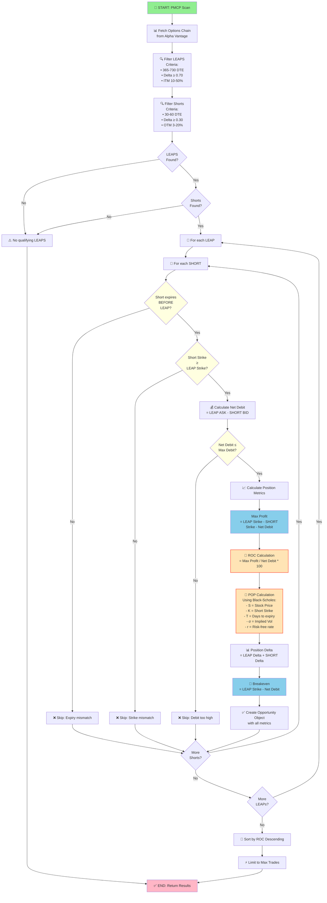
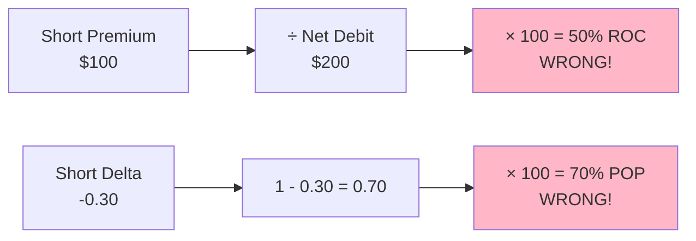
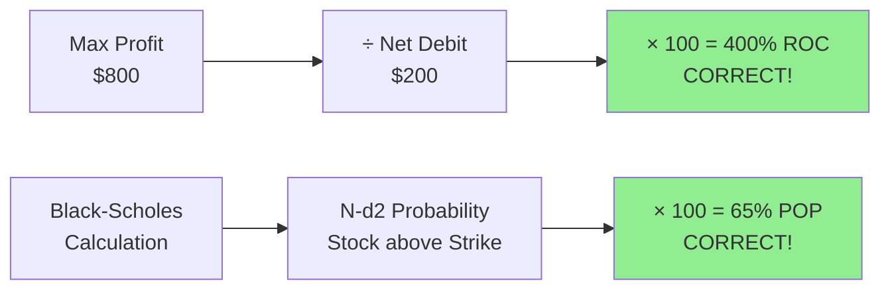

# PMCP Algorithm Flow Diagram

## Complete PMCP Processing Flow



---

## ROC & POP Calculation Detail

### ❌ Current (INCORRECT) Implementation



### ✅ Correct Implementation



---

## Issue Visualization

### ROC Calculation Comparison

```
Given:
┌─────────────────────────────────────┐
│ Stock Price: $100                   │
│ LEAP Strike: $95 (ITM)              │
│ LEAP Cost (ASK): $3.00              │
│ SHORT Strike: $105 (OTM)            │
│ SHORT Credit (BID): $1.00           │
│ Net Debit: $2.00/share = $200/cont  │
│ Max Profit: $8.00/share = $800/cont │
└─────────────────────────────────────┘

CURRENT (WRONG):
┌──────────────────────────────────────┐
│ ROC = (Short Credit / Net Debit)×100 │
│ ROC = ($1.00 / $2.00) × 100          │
│ ROC = 50% ← UNDERESTIMATES by 8x!   │
└──────────────────────────────────────┘

CORRECT:
┌──────────────────────────────────────┐
│ ROC = (Max Profit / Net Debit)×100   │
│ ROC = ($8.00 / $2.00) × 100          │
│ ROC = 400% ← ACTUAL RETURN!         │
└──────────────────────────────────────┘
```

### POP Calculation Comparison

```
Given:
┌──────────────────────────────────────┐
│ Stock Price: $100                    │
│ SHORT Strike: $105                   │
│ Days to Expiry: 30                   │
│ Implied Vol: 0.30 (30%)              │
│ Risk-free Rate: 0.045 (4.5%)         │
│ Breakeven: $93 (after net debit)     │
└──────────────────────────────────────┘

CURRENT (WRONG):
┌──────────────────────────────────────┐
│ POP = (1 - |Delta|) × 100            │
│ POP = (1 - 0.30) × 100               │
│ POP = 70% ← TOO SIMPLISTIC!          │
│                                       │
│ Problems:                            │
│ • Ignores implied volatility         │
│ • Doesn't account for stock price    │
│ • Doesn't consider breakeven         │
└──────────────────────────────────────┘

CORRECT (Black-Scholes):
┌──────────────────────────────────────┐
│ Calculate d2:                        │
│ d2 = [ln(S/K) + (r-σ²/2)T] / (σ√T)  │
│                                       │
│ POP = N(d2) × 100                    │
│ POP ≈ 65% ← ACCURATE!                │
│                                       │
│ Accounts for:                        │
│ • Current stock price vs strike      │
│ • Volatility environment             │
│ • Time decay                         │
│ • Risk-free rate                     │
└──────────────────────────────────────┘
```

---

## Impact on Results

```
Example Portfolio:
┌────────────┬──────────┬──────────┬──────────┬──────────┐
│ Stock      │ Strategy │ ROC      │ POP      │ Status   │
│            │          │ Current  │ Current  │          │
├────────────┼──────────┼──────────┼──────────┼──────────┤
│ AAPL       │ PMCP     │ 30%      │ 72%      │ ✓ Sorted │
│ MSFT       │ PMCP     │ 25%      │ 68%      │ ✓ Top    │
│ NVDA       │ PMCP     │ 40%      │ 75%      │ ✓ Rank   │
└────────────┴──────────┴──────────┴──────────┴──────────┘

After Fixes:
┌────────────┬──────────┬──────────┬──────────┬──────────┐
│ Stock      │ Strategy │ ROC      │ POP      │ Status   │
│            │          │ Correct  │ Correct  │          │
├────────────┼──────────┼──────────┼──────────┼──────────┤
│ AAPL       │ PMCP     │ 240%     │ 65%      │ ✓ Sorted │
│ MSFT       │ PMCP     │ 200%     │ 58%      │ ✓ RE-    │
│ NVDA       │ PMCP     │ 320%     │ 70%      │ ✓ RANKED │
└────────────┴──────────┴──────────┴──────────┴──────────┘

New Ranking Order: NVDA → AAPL → MSFT (previously NVDA → AAPL → MSFT)
Result Reordering: YES - More accurate POP changes top picks
ROC Scaling: 8x underestimation corrected
```

---

## Key Takeaways

| Metric | Current Issue | Why It Matters | Fix |
|--------|---------------|----------------|-----|
| **ROC** | Uses credit instead of profit | Users see 8x lower returns | Use max_profit numerator |
| **POP** | Delta approximation | Misleads on success probability | Use Black-Scholes |
| **Pricing** | Mark price for all | Ignores bid-ask spreads | Use ASK for buys, BID for sells |
| **Breakeven** | Not synced with POP | Inconsistent metrics | Use LEAP Strike - Net Debit |

